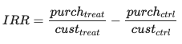
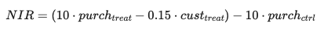
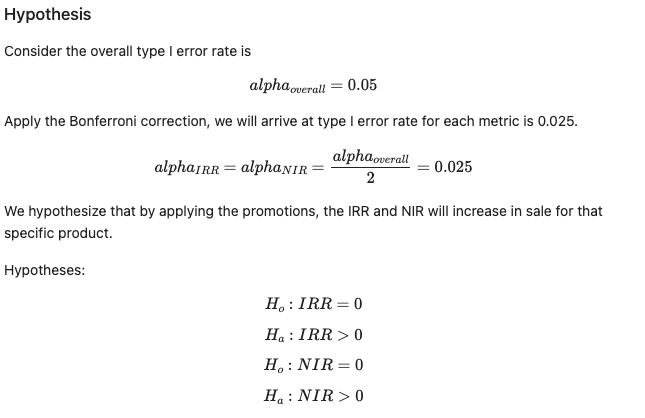
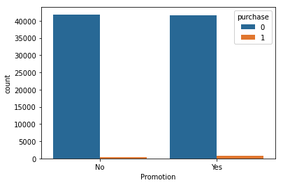

# Starbucks-Promotion-Strategy
- [Project Goal](#Project-Goal)
- [Project Pathway](#Pathway)
- [Installation](#Installation)
- [File Descriptions](#File-Descriptions)
- [Instructions](#How-To-Run-This-Project)
- [Results](#Results)
- [Discussion](#Discussion)
- [Licensing, Authors, Acknowledgements](#License)

## Project Goal 
The goal of this project is to create a model that gives promotions to users based on their features' patterns. Specifically, the goal is to maximize the two metrics: Incremental Response Rate (IRR) and Net Incremental Revenue (NIR)

**Background:** The dataset provided in this portfolio exercise was originally used as a take-home assignment provided by Starbucks for their job candidates. The data for this exercise consists of about 120,000 data points split in a 2:1 ratio between training and test files. In the experiment simulated by the data, an advertising promotion was tested to see if it would bring more customers to purchase a specific product priced at $10. Since it costs the company 0.15 to send out each promotion, it would be best to limit that promotion only to those that are most receptive to the promotion. Each data point includes one column indicating whether or not an individual was sent a promotion for the product, and one column indicating whether or not that individual eventually purchased that product. Each individual also has seven additional features associated with them, which are provided abstractly as V1-V7.

**The tasks** 
1. Use the training data to understand what patterns in V1-V7 indicate that a promotion should be provided to a user
2. Maximize the metrics:  
   a. Incremental Response Rate (IRR): depicts how many more customers purchased the product with the promotion, as compared to if they didn't receive the promotion. 
    
   Figure 1. Incremental Response Rate (IRR) equation.
   
   b. Net Incremental Revenue (NIR): depicts how much is made (or lost) by sending out the promotion. 
    
   Figure 2. Net Incremental Revenue (NIR) equation.

## Project Pathway 
### Part 1: Hypothesis Testing 
- The experiment was conducted and labeled results were collected. I analyze the results to see if giving out promotions helps with IRR and NIR
- Analyze is done by calculating the two KPIs (IRR, NIR) generated after the experiment.
- Identifying the effect of promotion is done by testing the hypotheses with the bootstrap technique

**Invariant metric**: to test whether there is a statistically significant difference between the 2 groups' size.

 
Figure 3. Hypothesis testing on the invariant metric to see if the number of customers in the control group is the same as in the treated group.

 
Figure 4. Hypothesis testing on the IRR and NIR metrics to see if giving out promotions makes a positive impact.

### Part 2: Build a Model 
- Select customers whose features (V1 - V7) will maximize the IRR and NIR, and give them the Promotion code (Treatment)
- This is a Feature Selection problem

## Installation 
The following packages and versions are used in this notebook. Any newer versions should work. 
| Package  | Version |
| ------------- | ------------- |
| Python  | 3.8.5  |
| Pandas  | 1.1.3  |
| Numpy   | 1.19.2 |
| Matplotlib | 3.3.2|
| imblearn   | 0.0  |
| xgboost | 1.5.2  |

## File Description 
There are 5 files in this repository.  
1. Two original training and test datasets are provided in `.csv` files  
2. A Jupyter notebook `.ipynb` includes the process of reading in, preprocessing, and modeling the dataset.  
3. A test `.py` file provided by Udacity
4. A README.md file as a brief look at this repository.

## Instructions 
* Execute the codes in this notebook and follow along with the insights to understand the decisions made throughout the process.

## Conclusions and Results 
### Hypothesis testing
- There is no significant difference in sample size between the control and treated groups
- Giving out promotions will drive up the purchase rate. However, there is no net positive revenue generated.
### Classification model
- The practical and best ML Promotion strategy utilizes **XGBoost**. This model produces IRR 0.0256, NIR = 87.15
- The best Promotion strategy is the custom model whose metrics are: IRR = 0.0212, NIR = 266.85

## Discussion 
### 1. Dataset distribution

 
Figure 5. The distribution of control (no promotion) and treated (received promotion) groups with regard to customer's purchase. 

This dataset is highly imbalanced. The number of customers not making purchases are much more than those who do, regardless of whether they receive promotional offers or not. For this reason, standard ML algorithms applying to the given data set will have a tendency to assign No-Promotion to all customers than trying to classify. 

Thus, SMOTE method was applied to resample and balance the data set.

### 2. Model choices
The Jupyter notebook `Startbucks Promotion Strategy_NP` entails two approaches.
- The first approach is a custom strategy that targets specific features. If satisfied, the user will receive the promotion. This approach only works if there is a manageable amount of features
- The second approach is applying an ML model. I compared the performance of 3 models: Logistic regression, Balanced random forest classifier, and XGBoost. XGBoost performed best resulting in the highest IRR value and a positive NIR value.

### 3. Suggestions
The following suggestions can improve the model:  
a. A more balanced data set 
b. Or other classifiers for an imbalanced data set

## Licensing, Authors, Acknowledgements 
* Starbucks for providing the datasets and project goal
* [Udacity](https://www.udacity.com/) for instructions
* Author: [Nguyen Pham](https://github.com/Az-otrope)

